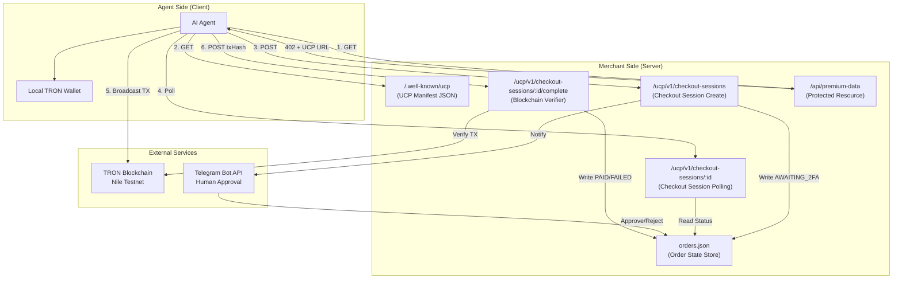
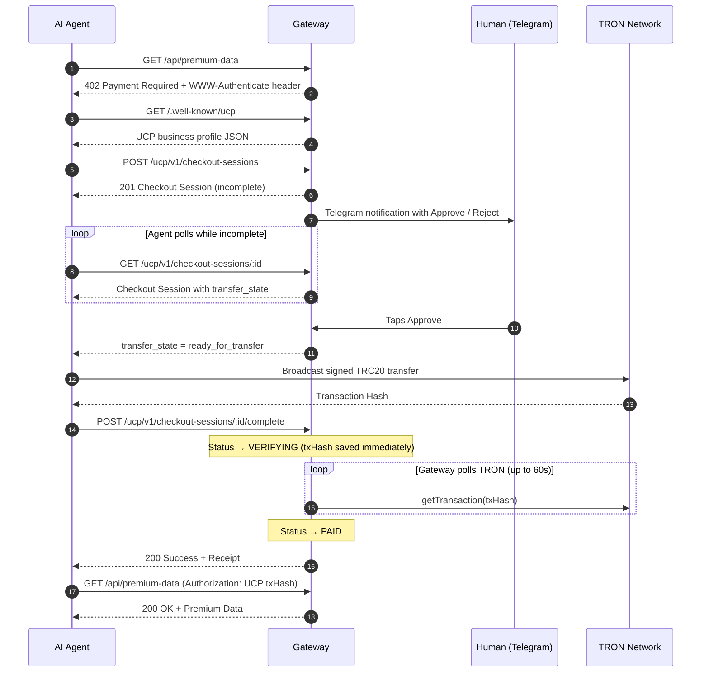
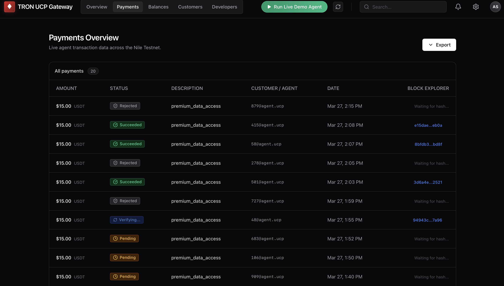
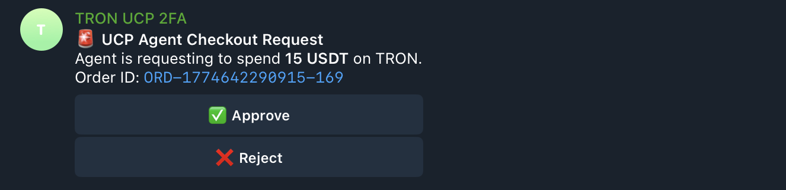

# TRON UCP Demo

> Giving AI agents the ability to transact autonomously — while keeping humans in control.

### Table of Contents

| | |
|---|---|
| [**⚡ Get Started in 3 Minutes**](#-get-started-in-3-minutes) | **Clone → Configure → Run** |
| [The Problem](#the-problem) | Why agents need payment rails |
| [The Solution](#the-solution) | UCP + HTTP 402 + Telegram HITL |
| [Architecture Overview](#architecture-overview) | System diagram |
| [Understanding UCP](#understanding-ucp) | The protocol explained |
| [How TRON Fits In](#how-tron-fits-in) | Non-custodial settlement |
| [Full Transaction Lifecycle](#full-transaction-lifecycle) | 8-step walkthrough |
| [System Components](#system-components) | Server, state store, manifest, bot, dashboard |
| [Merchant Dashboard](#merchant-dashboard) | The Stripe-like operator interface |
| [Screenshots](#screenshots) | Dashboard and Telegram UI |
| [Security Model](#security-model) | Threat/mitigation matrix |

---

## ⚡ Get Started in 3 Minutes

> **No smart-contract deployment. No wallet custody. No complex infrastructure.**
> Plug in four environment variables and you're live.

### Prerequisites

| Tool | Version | Why |
|---|---|---|
| **Node.js** | ≥ 18 | Runtime for the gateway server and dashboard |
| **npm** | ≥ 9 | Comes with Node — manages dependencies |
| **Telegram** | Any | You'll receive 2FA approval requests here |
| **TRON Wallet** | Nile Testnet | Your merchant receiving address ([get one free](https://nileex.io/join/getJoinPage)) |

### Step 1 — Clone & Install

```sh
git clone https://github.com/<your-org>/tron-ucp.git
cd tron-ucp
npm install              # installs the gateway server
cd frontend && npm install && cd ..   # installs the dashboard
```

That's it — two `npm install` commands, zero native dependencies.

### Step 2 — Configure (one file)

Copy the example environment file and fill in your values:

```sh
cp .env.example .env
```

Then open `.env` and set these four variables:

```env
# ── Your TRON Nile Testnet wallet (where you receive payments)
MERCHANT_ADDRESS=TYourWalletAddressHere

# ── Private key for the demo agent (test key only — NOT your merchant key)
TRON_PRIVATE_KEY=your_test_agent_private_key

# ── Telegram bot token (create one via @BotFather in ~30 seconds)
TELEGRAM_BOT_TOKEN=123456:ABC-DEF...

# ── Your personal Telegram chat ID (send /start to @userinfobot to get it)
TELEGRAM_CHAT_ID=123456789
```

> **💡 Where do I get these?**
>
> | Value | How to get it |
> |---|---|
> | `MERCHANT_ADDRESS` | Install TronLink or use [Nile Faucet](https://nileex.io/join/getJoinPage) — copy your base58 address |
> | `TRON_PRIVATE_KEY` | Export from TronLink, or generate a test key at [tronweb docs](https://tronweb.network) |
> | `TELEGRAM_BOT_TOKEN` | Open Telegram → search **@BotFather** → `/newbot` → copy the token |
> | `TELEGRAM_CHAT_ID` | Open Telegram → search **@userinfobot** → `/start` → copy the ID |

### Step 3 — Run

```sh
# Terminal 1 — Start the server
node server.js

# Terminal 2 — Start the merchant dashboard
cd frontend && npm run dev
```

Open **http://localhost:5173** — your merchant dashboard is live. 🎉

Hit the **"Run Live Demo Agent"** button to see a full payment lifecycle in real time, right from the dashboard.

### What Just Happened?

In under 3 minutes you now have:
- ✅ A **UCP-compliant payment gateway** accepting TRC20 USDT on TRON Nile
- ✅ A **Stripe-like merchant dashboard** with live transaction monitoring
- ✅ A **Telegram 2FA firewall** — no payment goes through without your explicit tap
- ✅ A **one-click demo agent** that runs the full checkout lifecycle end-to-end

> **Production note:** This repo is wired for TRON Nile testnet. Moving to mainnet is not a one-line change. You would need to update the TRON node endpoints, the displayed network labels, the USDT contract address, and your merchant wallet configuration before using it for real funds.

---

> *The sections below explain the protocol, architecture, and security model in detail. The gateway is already running — read on when you're ready to go deeper.*

---

## The Problem

AI agents are becoming autonomous participants on the internet. They browse APIs, gather data, and act on behalf of humans. But the moment an agent needs to **pay** for something — access a premium API, purchase compute, acquire licensed data — everything breaks down. Today's payment rails are designed for humans clicking buttons in browsers, not for machines negotiating prices over HTTP.

At the same time, giving an AI agent unrestricted access to a wallet is dangerous. Without guardrails, a misconfigured prompt or a hallucinating model could drain funds in seconds.

**We need two things simultaneously:**
1. A standardized protocol that lets agents discover, negotiate, and settle payments autonomously — without hardcoded API keys or manual intervention.
2. A security layer that keeps a human in the loop, so no money moves without explicit approval.

---

## The Solution

This project is a payment infrastructure layer built on the **TRON blockchain** that solves both problems through three interlocking systems:

| Layer | Role |
|---|---|
| **Universal Commerce Protocol (UCP)** | A standardized JSON schema that any merchant publishes at a well-known URL. Agents read it to understand *what* to pay, *how much*, and *on which blockchain* — with zero prior configuration. |
| **HTTP 402 Payment Gate** | The web's native "Payment Required" status code, repurposed as a machine-readable paywall. When an agent hits a gated endpoint, it receives structured instructions on how to pay, not an error page. |
| **Telegram HITL 2FA** | A human-in-the-loop firewall. Every payment request is frozen until the wallet owner explicitly approves it via Telegram. The agent cannot proceed until the human taps "Approve". |

---

## Architecture Overview



---

## Understanding UCP

> **Official sources:** [UCP Specification](https://ucp.dev) · [GitHub](https://github.com/Universal-Commerce-Protocol/ucp) · [JS SDK](https://github.com/Universal-Commerce-Protocol/js-sdk) · [Sample Implementations](https://github.com/Universal-Commerce-Protocol/samples)

### What is UCP?

The [Universal Commerce Protocol](https://ucp.dev) is an open standard co-developed by Google, Shopify, and other industry leaders to enable **agentic commerce** — allowing AI agents to discover, negotiate, and settle payments without custom integrations. A merchant server publishes a JSON manifest at `/.well-known/ucp`, the equivalent of a restaurant putting its menu in the window — any agent walking by can read it and understand how to order without asking a waiter.

The manifest declares:

```json
{
  "name": "TRON UCP Demo Merchant",
  "url": "http://localhost:8000",
  "ucp": {
    "version": "2026-01-23",
    "services": {
      "dev.ucp.shopping": [
        {
          "endpoint": "http://localhost:8000/ucp/v1"
        }
      ]
    },
    "capabilities": {
      "dev.ucp.shopping.checkout": [
        {
          "version": "2026-01-23"
        }
      ]
    },
    "payment_handlers": {
      "localhost.tron.trc20_usdt": [
        {
          "version": "1.0.0"
        }
      ]
    }
  }
}
```

| Field | Purpose |
|---|---|
| `ucp.services.dev.ucp.shopping[0].endpoint` | Tells the agent where the checkout REST service lives. In this repo, it is `/ucp/v1`. |
| `ucp.capabilities.dev.ucp.shopping.checkout` | Declares support for the official-style shopping checkout capability. |
| `ucp.payment_handlers.localhost.tron.trc20_usdt` | Declares the TRON-specific payment handler used by checkout sessions in this demo. |
| Handler `config` and payment instrument `display` fields | Carry the TRON network, token contract, receiver address, amount, and transfer state the agent needs to build a payment. |

### Why Agents Need UCP

Without UCP, an agent would need to be pre-programmed with every merchant's payment details — their wallet address, accepted tokens, network, and API structure. This doesn't scale.

With UCP, **any agent can pay any merchant** by following three steps (see the [Checkout capability spec](https://ucp.dev/latest/specification/playground/) for the full schema):
1. Read the manifest at `/.well-known/ucp`
2. Read the shopping service endpoint and declared [Checkout capability](https://ucp.dev)
3. Settle the payment on the declared blockchain

The protocol is transport- and blockchain-agnostic by design — it supports REST, JSON-RPC, MCP, and A2A transports out of the box ([spec details](https://github.com/Universal-Commerce-Protocol/ucp)). This implementation uses TRON, but the same manifest structure could declare Ethereum, Solana, or any other network.

---

## How TRON Fits In

TRON serves as the settlement layer. When the agent is ready to pay, it constructs a `TriggerSmartContract` transaction — a direct call to the TRC20 USDT token's `transfer()` function on-chain.

**The agent signs the transaction locally.** Private keys never leave the client. The merchant server only receives the resulting transaction hash (`txHash`) and independently verifies it against the TRON blockchain using `tronWeb.trx.getTransaction()`.

This is a critical design choice: the merchant never holds or touches any private keys. Settlement is fully non-custodial.

---

## Full Transaction Lifecycle

Below is the complete lifecycle of a single payment, from first contact to data delivery. Every step is explained with its HTTP method, endpoint, and the reason it exists.



---

### Step 1 — Resource Discovery

| | |
|---|---|
| **Call** | `GET /api/premium-data` |
| **Response** | `HTTP 402 Payment Required` |
| **Intent** | The agent tries to access a protected resource. Instead of a generic 403 Forbidden, the server responds with HTTP 402 — the web standard for "you need to pay." The response body and `WWW-Authenticate` header contain the URL to the UCP manifest, telling the agent exactly where to learn how to pay. |

### Step 2 — Manifest Fetch

| | |
|---|---|
| **Call** | `GET /.well-known/ucp` |
| **Response** | UCP business profile JSON |
| **Intent** | The agent reads the merchant's machine-readable business profile. It learns the checkout REST base (`/ucp/v1`), the checkout capability (`dev.ucp.shopping.checkout`), and the TRON payment handler advertised by the server. |

### Step 3 — Checkout Session Creation

| | |
|---|---|
| **Call** | `POST /ucp/v1/checkout-sessions` with `buyer` and `line_items` |
| **Response** | `HTTP 201 Created` with a checkout session resource |
| **Intent** | The agent requests to buy the premium resource. The server creates a checkout session in `orders.json`, calculates the total in base units, marks the session `AWAITING_2FA`, and returns a structured checkout resource with a selected TRON payment instrument. The payment instructions exist immediately, but the transfer state is not usable until human approval. |

### Step 4 — Human Approval (Telegram 2FA)

| | |
|---|---|
| **Trigger** | Automatic — the server sends a Telegram message or prints a local approval URL the instant the session is created |
| **Intent** | This is the safety valve. The human wallet owner reviews the requested checkout and can approve or reject it. The agent keeps polling the checkout session resource until the selected payment instrument reports `transfer_state: "ready_for_transfer"` or the session is rejected/canceled. |

### Step 5 — Checkout Session Polling

| | |
|---|---|
| **Call** | `GET /ucp/v1/checkout-sessions/:id` |
| **Response** | `HTTP 200` with the latest checkout session state |
| **Intent** | The agent observes the selected payment instrument over time. Before approval it sees `awaiting_human_approval`. After approval it sees `ready_for_transfer`, along with the receiver address, token contract, and amount needed to build the TRC20 transfer. |

### Step 6 — On-Chain Settlement

| | |
|---|---|
| **Action** | Agent builds, signs, and broadcasts a `TriggerSmartContract` TRC20 transfer |
| **Intent** | The agent uses its local wallet to construct a raw smart contract call to the TRC20 token's `transfer(address, uint256)` function. It signs the transaction with its private key (which never leaves the client), broadcasts it to the TRON network, and receives a transaction hash. |

### Step 7 — Verification & Receipt

| | |
|---|---|
| **Call** | `POST /ucp/v1/checkout-sessions/:id/complete` with the payment instrument receipt |
| **Response** | `HTTP 200` with the updated checkout session |
| **Intent** | The agent submits proof of payment. The server immediately saves the `txHash` and sets the order status to `VERIFYING` (so the dashboard reflects progress in real time). It then polls the TRON network using `tronWeb.trx.getTransaction()` until the transaction is confirmed. Once confirmed, it verifies the transaction type (`TriggerSmartContract`) and the method signature (`a9059cbb` = ERC20/TRC20 `transfer`). If everything checks out, the order transitions to `PAID`. If the transaction reverts or times out, it transitions to `FAILED`. |

### Step 8 — Data Delivery

| | |
|---|---|
| **Call** | `GET /api/premium-data` with header `Authorization: UCP <txHash>` |
| **Response** | `HTTP 200` with the premium payload |
| **Intent** | The agent retries the original gated endpoint, this time including the `txHash` as a receipt in the Authorization header. The server looks up the hash in `orders.json`, confirms it corresponds to a `PAID` order, and grants access. |

---

## System Components

### Gateway Server (`server.js`)

The Express.js application that hosts all UCP endpoints, manages order state, communicates with Telegram, and verifies transactions against the TRON blockchain using TronWeb.

### Order State Store (`orders.json`)

A flat-file JSON database managed by `db.js`. Each order record tracks the full lifecycle:

```json
{
  "id": "chk_1744040000000_123",
  "merchant_order_id": "ord_chk_1744040000000_123",
  "payment_instrument_id": "pi_chk_1744040000000_123",
  "buyer": { "id": "agent-abc123", "type": "autonomous_agent" },
  "line_items": [{ "id": "li_1" }],
  "total_amount": "15.000000",
  "amount_in_base_units": 15000000,
  "currency": "USDT",
  "status": "PAID",
  "txHash": "94943ca4b465d7b5...",
  "createdAt": "2026-04-07T14:00:00.000Z",
  "updatedAt": "2026-04-07T14:00:15.000Z"
}
```

**Order statuses and their meaning:**

| Status | Meaning |
|---|---|
| `AWAITING_2FA` | Order created. Waiting for human approval via Telegram. |
| `PENDING` | Human approved. Payment challenge released to agent. |
| `VERIFYING` | Agent submitted a `txHash`. Server is polling TRON for confirmation. |
| `PAID` | Transaction confirmed on-chain. Receipt is valid. |
| `FAILED` | Transaction timed out or reverted on-chain. |
| `REJECTED` | Human explicitly denied the transaction via Telegram. |
| `CANCELED` | The checkout session was canceled before successful payment. |

### UCP Manifest (`/.well-known/ucp`)

A dynamic UCP business profile served by the gateway. This is the entry point for any UCP-compatible agent. It advertises the shopping service endpoint, checkout capability, and TRON payment handler metadata. Agents discover this URL through the `WWW-Authenticate` header on 402 responses.

### Telegram Bot (HITL 2FA Layer)

A `node-telegram-bot-api` integration that sends inline-keyboard messages to the wallet owner's Telegram chat. The bot listens for callback queries (`approve_<orderId>` or `reject_<orderId>`) and updates the corresponding order status in `orders.json`. This creates an asynchronous approval gate that the agent cannot bypass.

### Merchant Dashboard

The dashboard is a React-based operator interface modeled after Stripe's merchant console — rebuilt from the ground up for an economy where your customers are AI agents, not humans.

In traditional e-commerce, a merchant dashboard shows orders placed by people through web forms. In agentic commerce, there are no web forms. Orders originate from autonomous scripts hitting your API programmatically, 24/7, at machine speed. The dashboard is how the merchant — the human — maintains visibility and control over a marketplace that operates faster than they can observe.

#### Why It Matters

When agents transact autonomously, the merchant needs a control plane that answers three questions in real time:

1. **What is happening right now?** — Which agents are requesting access, which transactions are awaiting my approval, and which payments are settling on-chain?
2. **Did it work?** — Did a specific transaction confirm on the blockchain, or did it revert? Can I click through to the block explorer and verify independently?
3. **What's my exposure?** — How much gross volume has flowed through the gateway? How many sessions are still pending? What's my conversion rate from checkout to paid?

The dashboard answers all three through five integrated tabs:

| Tab | Purpose |
|---|---|
| **Overview** | Aggregate KPIs: gross revenue, UCP conversion rate, and a revenue trend chart. A single-glance summary of gateway health. |
| **Payments** | A live transaction table showing every order with its amount, status badge, agent identifier, timestamp, and a clickable TronScan link. Statuses update automatically as the order moves through the lifecycle (`AWAITING_2FA` → `PENDING` → `VERIFYING` → `PAID` / `FAILED` / `REJECTED`). |
| **Balances** | Settled funds overview, showing the total confirmed revenue, the blockchain network, and the token asset. |
| **Customers** | An agent registry. Every unique agent that has transacted with the gateway is listed with its session count, total verified spend, and last-active timestamp. In agentic commerce, your "customers" are identified by wallet-derived pseudonyms, not email addresses. |
| **Developers** | API key management, webhook configuration, and a recent API request log. This is where a merchant would configure programmatic integrations with their own backend systems. |

#### Live Agent Visualizer

The dashboard includes a **"Run Live Demo Agent"** button in the navigation bar. When clicked, it simultaneously:
- Spawns an autonomous agent process on the server
- Opens a terminal-style modal that narrates the agent's decision-making in real time — showing each HTTP call, the 402 challenge, the Telegram suspension, and the blockchain broadcast as they happen

This turns the dashboard into a live demo environment where the operator can watch an agent traverse the entire UCP lifecycle while the Payments tab updates behind it.

#### Design Philosophy

The interface uses a dark-mode, information-dense design language inspired by modern fintech dashboards. Every interactive element has a unique ID for automated testing. Status badges use distinct colors per lifecycle phase so the merchant can scan the table at a glance:

| Status | Color | Meaning |
|---|---|---|
| Awaiting 2FA | Purple, pulsing | Frozen. Waiting for your Telegram approval. |
| Pending | Amber | Approved. Agent is constructing the transaction. |
| Verifying | Blue, spinning | Transaction broadcast. Polling the blockchain. |
| Succeeded | Green | Confirmed on-chain. Receipt valid. |
| Failed | Red | Transaction reverted or timed out. |
| Rejected | Gray | You denied this request via Telegram. |

---

## Screenshots

### Dashboard — Payments View



### Dashboard — Live Agent Visualizer


### Telegram 2FA Approval



---

---

## Security Model

| Threat | Mitigation |
|---|---|
| Agent drains wallet without permission | Every checkout is frozen at `AWAITING_2FA` until a human explicitly approves via Telegram |
| Merchant steals agent's private key | Private keys never leave the client. The merchant only receives the `txHash` after broadcast. |
| Fake transaction hash submitted | The server independently verifies every `txHash` against the TRON blockchain, checking contract type (`TriggerSmartContract`) and method signature (`a9059cbb`). |
| Receipt replay attack | Each `txHash` maps to exactly one order. A hash that's already been used for a `PAID` order cannot unlock additional resources. |
| Human never responds to 2FA | The agent polls indefinitely. In production, a configurable timeout would transition the order to `EXPIRED`. |
